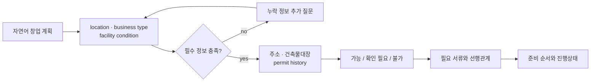

# HEOGAON

소상공인의 자연어 창업 계획을 필요한 인허가 확인 항목, 서류, 처리 순서와 담당 부서로
변환하는 **근거 기반 AI 인허가 사전진단 서비스**입니다.

SSAFY x Kakao Tech Bootcamp AI Hackathon에서 **103개 팀 중 본선 6개 팀**에
선발됐습니다.


[시연 영상](https://youtu.be/qiv1yjfYUZQ) ·
[발표 자료](https://github.com/user-attachments/files/28921796/_.pdf) ·
[전체 포트폴리오](https://github.com/JuHyeon-Nam/JuHyeon-Nam-archive)

<p align="center">
  <a href="https://youtu.be/qiv1yjfYUZQ">
    
  </a>
</p>

## Project Summary

| Item | Description |
|---|---|
| Problem | 업종·주소·시설 조건에 따라 달라지는 인허가 절차를 사용자가 직접 탐색해야 함 |
| Input | 자연어 창업 계획과 단계별 추가 답변 |
| Output | 가능성 판단, 확인 필요 항목, 준비 서류, 우선순위, 담당 부서 |
| Core design | backend state machine, knowledge graph, evidence-aware fallback |
| Data | 2,069 nodes, 3,429 relations, document·department SQLite data |
| Result | SSAFY 103개 팀 중 hackathon final 6 teams |

## My Contribution

남주현은 팀원으로 서비스의 **사용자 시나리오와 AI 응답 신뢰성 검증**을 담당했습니다.

- 사용자가 제공하지 않은 조건을 모델이 임의로 채우는 오류 조건 정리
- 필수 정보가 없을 때 결과 생성 대신 추가 질문으로 전환되는 흐름 검토
- 법령·정부 문서 기반 결과의 필요 서류, 담당 부서와 근거 연결 확인
- GraphRAG·외부 API 실패 시 local graph와 rule path로 전환되는 fallback 검증
- 카페 창업 등 10개 대표 시나리오 반복 실행과 실패 조건 기록

지식 그래프 구축, backend 전체와 frontend 전체를 개인 단독 구현한 것으로 표현하지
않습니다. 아래 기술 구조는 팀 프로젝트 전체 범위입니다.

## User Flow



사용자는 한 번에 모든 조건을 입력할 필요가 없습니다. backend가 현재 case state를
관리하고, 부족한 정보만 질문한 뒤 판단 근거와 다음 작업을 화면에 전달합니다.

## Architecture

```mermaid
flowchart TB
    ui["Next.js thin client"] -->|ApiEnvelope| api["FastAPI case API"]
    api --> state["case state machine"]
    state --> intake["slot extraction<br/>question planner"]
    state --> decision["permit decision engine"]
    decision --> graph["knowledge graph<br/>2,069 nodes / 3,429 edges"]
    decision --> docs["document guide SQLite"]
    decision --> dept["department mapping SQLite"]
    decision --> public["address · building ledger<br/>public APIs"]
    graph --> evidence["law · government source chunks"]
    public -. failure .-> fallback["local graph · rules · catalog"]
    fallback --> decision
```

## Technical Design

### Frontend

- Next.js 15, React 19, TypeScript
- backend가 전달한 `view.type`에 맞춰 화면을 그리는 thin-client 구조
- 모바일 우선 화면, session restore, address search, progress dashboard
- development query를 이용한 주요 view별 deterministic preview

### Backend

- FastAPI, Pydantic, in-memory case repository
- `UNDERSTAND -> NEEDS_INFO -> DIAGNOSIS -> DOCUMENTS -> DASHBOARD` state flow
- 공통 response envelope로 `view`, `statePatch`, metadata 전달
- LLM·rule·local graph를 동일한 flow에서 교체 가능한 provider 구조

### Domain Data

- knowledge graph CSV: permit, document, prerequisite, department, evidence relation
- document issue guide SQLite: 발급처, 준비정보, 처리시간, 선행 서류
- department mapping SQLite: 기능 단위 부서를 서울 자치구 실제 부서로 연결
- address, building ledger and local permit-history integration path

## Troubleshooting

### 1. Missing information caused invented assumptions

사용자가 판매 품목이나 시설 조건을 생략했는데도 모델이 임의로 채우는 문제가 있었습니다.
필수 slot이 비어 있으면 판정을 보류하고 단일 질문으로 되묻도록 흐름을 검증했습니다.

### 2. External failure stopped the whole response

LLM·GraphRAG·공공 API 중 하나가 실패하면 전체 결과가 중단될 수 있었습니다. 원격 결과가
없어도 local graph, SQLite data와 rule catalog를 순차 사용하도록 fallback 경로를 두고
대표 시나리오에서 결과 형식이 유지되는지 확인했습니다.

### 3. Department names differed by district

같은 기능도 자치구마다 실제 부서명이 달랐습니다. 그래프에는 기능 단위 부서를 저장하고
질의 시점에 district mapping을 적용해 지역 확장 시 그래프 복제를 피했습니다.

### 4. Frontend and backend state could drift

화면이 업무 규칙을 직접 소유하면 단계가 늘어날수록 상태가 불일치했습니다. backend를
single source of truth로 두고 frontend는 typed envelope를 렌더링하도록 역할을 분리했습니다.

## Repository Guide

| Path | Description |
|---|---|
| `app/`, `src/components/` | Next.js page and user-flow views |
| `src/types/flow.ts` | frontend/backend view contract |
| `backend/app/main.py` | FastAPI routes |
| `backend/app/services/` | flow, question, view and document services |
| `heogaon/intake/` | slot contract, extraction and question policy |
| `heogaon/decision_engine/` | permit judgement |
| `heogaon/graph/` | knowledge graph data and documentation |
| `heogaon/document_issue_guide/` | document requirement SQLite pipeline |
| `heogaon/department_mapping/` | district department mapping pipeline |
| `docs/FLOW.md` | canonical UX flow |
| `docs/RUNTIME.md` | runtime and integration notes |

## Run

### Frontend

```bash
npm install
npm run dev -- -p 3103
```

Frontend: `http://127.0.0.1:3103`

Main views can be reviewed without external API keys in development mode:

```text
http://127.0.0.1:3103/?dev=diagnosis
http://127.0.0.1:3103/?dev=documents
http://127.0.0.1:3103/?dev=dashboard
```

### Backend

```bash
cd backend
python -m venv .venv
source .venv/bin/activate
pip install -r requirements.txt
python -m uvicorn app.main:app --host 127.0.0.1 --port 4100
```

Copy `.env.example` to `.env` and add only the integrations you want to test. Real keys must never
be committed. With no LLM key, the local rule fallback remains available.

## API Overview

| Method | Endpoint | Purpose |
|---|---|---|
| `GET` | `/health` | runtime health check |
| `POST` | `/api/cases` | create a case from natural-language input |
| `GET` | `/api/cases/{case_id}` | restore current case state |
| `POST` | `/api/cases/{case_id}/turns` | apply slot answer or user action |
| `GET` | `/api/address/search` | address lookup with fallback |
| `*` | `/api/admin/...` | password-protected data administration |

## Team

| Member | Role |
|---|---|
| 조성익 | Team lead |
| 고은찬 | Team member |
| 김경민 | Team member |
| **남주현** | **User-scenario design and AI response validation** |
| 박종화 | Team member |
| 장민주 | Team member |

## Limitations

- 사전진단 결과는 행정기관의 최종 허가를 대체하지 않습니다.
- external API 상태와 지자체별 최신 규정에 따라 추가 확인이 필요합니다.
- 10개 대표 시나리오는 기능 검증 범위이며 전체 업종·지역을 대표하지 않습니다.
- 본선 진출은 팀 성과이며 개인 기여는 별도 항목에 구분했습니다.
